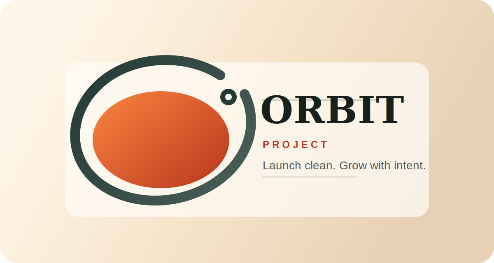

# Orbit

Turn any web application into a scalable, maintainable, and successful product



Orbit is a simple, efficient Node.js web starter built for anyone to use, adapt, and contribute to.

## Overview

Orbit now ships as a ready-to-use minimal application with:

- multi-page routing
- a public JSON API
- zero external runtime dependencies
- a built-in test suite
- GitHub Actions CI

## Accessibility

Orbit is intended to be open and accessible to anyone. The API responds with permissive CORS headers so it can be consumed from anywhere.

## Included Routes

- `/` home page
- `/features` feature overview
- `/docs` starter documentation
- `/api/status` JSON health and metadata endpoint

## Run Locally

```bash
npm install
npm run start
```

For automatic reload during development:

```bash
npm run dev
```

Run the test suite:

```bash
npm test
```

## Continuous Integration

GitHub Actions is configured in [.github/workflows/ci.yml](.github/workflows/ci.yml).

It runs on pushes to `main` and on pull requests, then:

- checks out the repository
- sets up Node.js
- installs dependencies
- runs `npm test`


## Project Structure

```text
.
├── .github/workflows/ci.yml
├── public/styles.css
├── src/app.js
├── src/config.js
├── src/routes.js
├── src/server.js
├── src/templates.js
└── test/routes.test.js
```

## Screenshots


## 👨‍🍳 Author

Designed and developed with ❤️ by **[Pierre-Henry Soria](https://ph7.me)**.  
Product Engineer building systems for better thinking and decision-making.  
Roquefort 🧀 and ristretto enthusiast.

---

[](https://x.com/phenrysay)
[](https://bsky.app/profile/pierrehenry.dev "Follow Me on BlueSky")
[](https://github.com/pH-7)
[](https://ko-fi.com/phenry)
