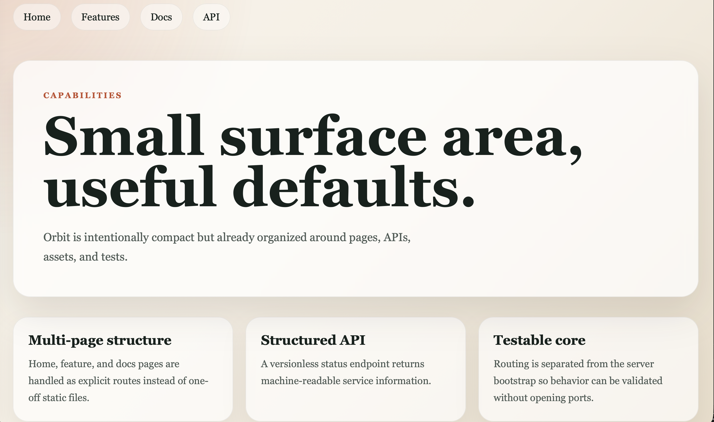

# Orbit Project™


### Turn any web application into a scalable, maintainable, and successful product

Orbit is a simple, efficient Node.js web starter built for anyone to use, adapt, and contribute to.

## Overview

Orbit now ships as a ready-to-use minimal application with:

- multi-page routing
- a public JSON API
- zero external runtime dependencies
- a built-in test suite
- GitHub Actions CI

## Accessibility

Orbit is intended to be open and accessible to anyone. The API responds with permissive CORS headers so it can be consumed from anywhere.

## Included Routes

- `/` home page
- `/features` feature overview
- `/docs` starter documentation
- `/api/status` JSON health and metadata endpoint

## Run Locally

```bash
npm install
npm run start
```

For automatic reload during development:

```bash
npm run dev
```

Run the test suite:

```bash
npm test
```

## Continuous Integration

GitHub Actions is configured in [.github/workflows/ci.yml](.github/workflows/ci.yml).

It runs on pushes to `main` and on pull requests, then:

- checks out the repository
- sets up Node.js
- installs dependencies
- runs `npm test`


## Project Structure

```text
.
├── .github/workflows/ci.yml
├── public/styles.css
├── src/app.js
├── src/config.js
├── src/routes.js
├── src/server.js
├── src/templates.js
└── test/routes.test.js
```

## Screenshots



## 👨‍🍳 Author

Designed and developed with lots of ❤️ by **[Pierre-Henry Soria](https://ph7.me)**. A **SUPER Passionate** Belgian Software Engineer 🍫🍺

[![@phenrysay][x-badge]](https://x.com/phenrysay) [![BlueSky][bsky-badge]](https://bsky.app/profile/pierrehenry.dev "Follow Me on BlueSky") [![pH-7][github-badge]](https://github.com/pH-7) [![PayPal][paypal-badge]](https://www.paypal.com/cgi-bin/webscr?cmd=_s-xclick&hosted_button_id=X457W3L7DAPC6)


[](https://www.linkedin.com/in/ph7enry/ "Pierre-Henry Soria LinkedIn") [](https://wa.me/61426874095?text=I%27m%20looking%20for%20a%20software%20engineer%20like%20you)
